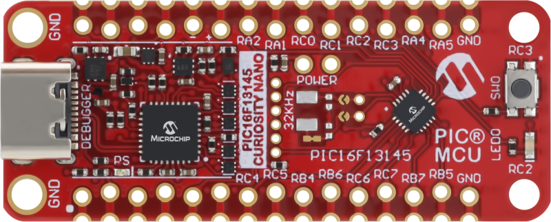
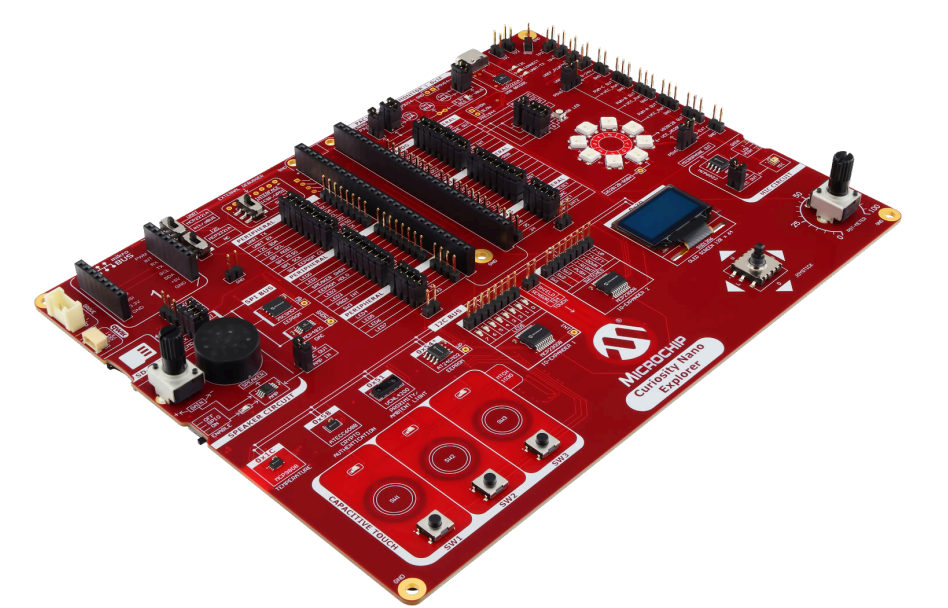
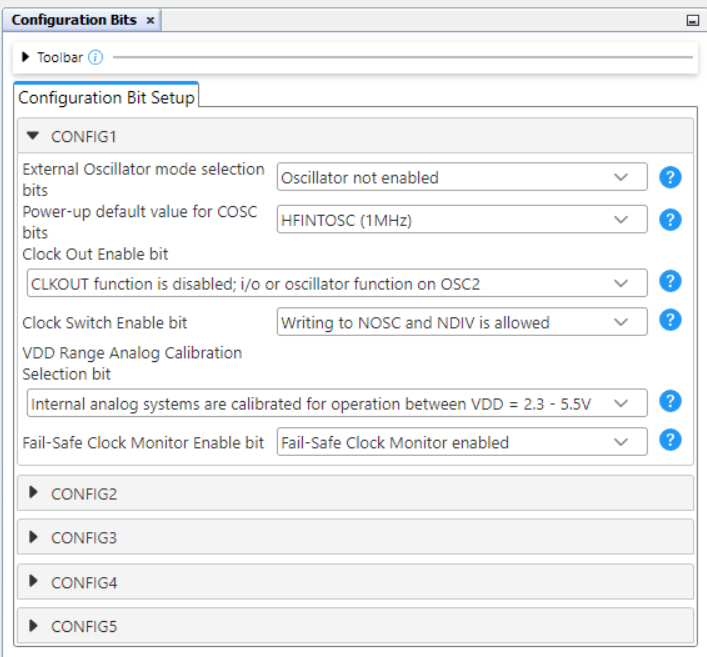
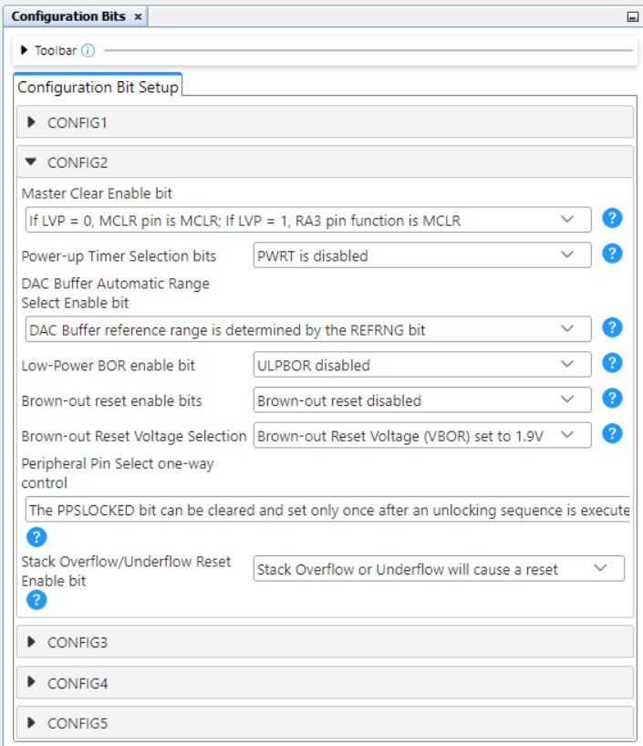
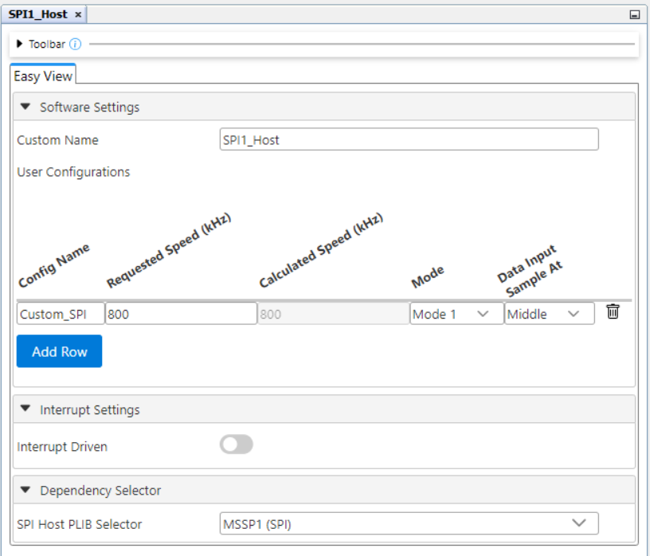
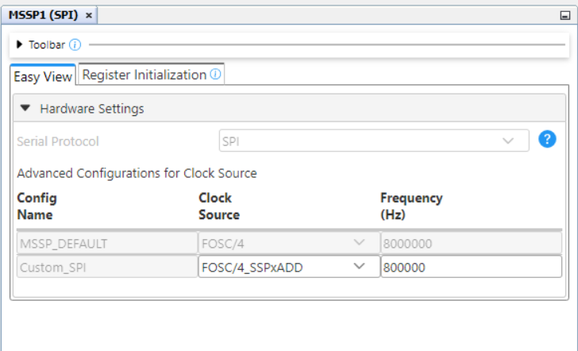
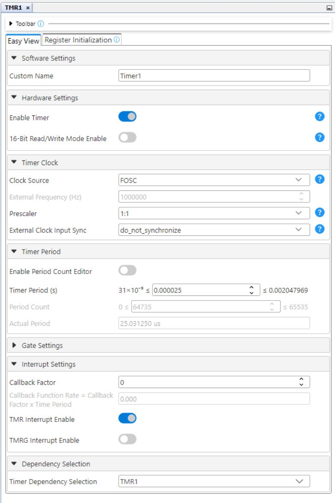
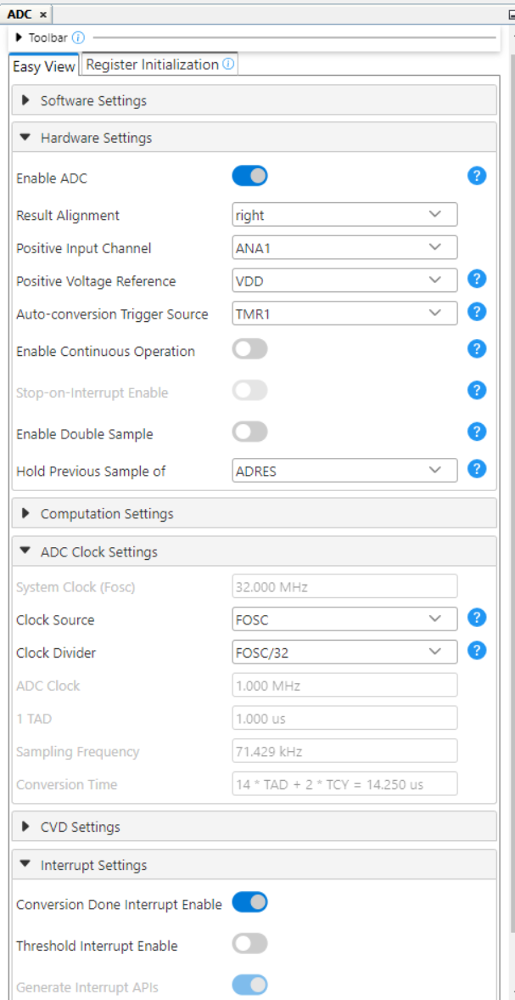
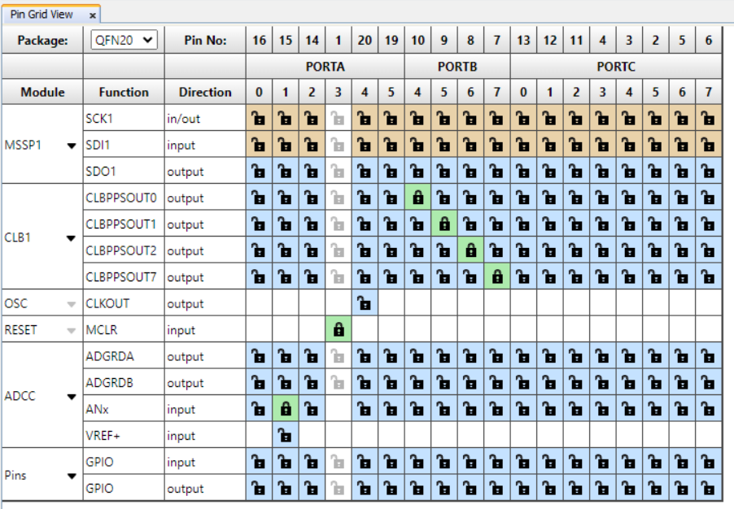

<!-- Please do not change this html logo with link -->

# Spectrum Analyzer Using the PIC16F13145 Microcontroller With MCC Melody

This repository contains an MPLAB® X project that implements a Fast Fourier Transform (FFT) Spectrum Analyzer using the PIC16F13145 microcontroller. The audio input is provided from a cable jack and the frequency spectrum result is displayed on a 16x16 WS2812 LED matrix. The application translates the messages sent by the Serial Peripheral Interface (SPI) into messages intelligible by WS2812 using a Configurable Logic Block (CLB) peripheral.

## Related Documentation

More details and code examples on the PIC16F13145 can be found at the following links:

- [PIC16F13145 Product Page](https://www.microchip.com/en-us/product/PIC16F13145?utm_source=GitHub&utm_medium=TextLink&utm_campaign=MCU8_PIC16F13145&utm_content=pic16f13145-spectrum-analyzer-mplab-mcc-github&utm_bu=MCU08)
- [PIC16F13145 Code Examples on Discover](https://mplab-discover.microchip.com/v2?dsl=PIC16F13145)
- [PIC16F13145 Code Examples on GitHub](https://github.com/microchip-pic-avr-examples/?q=PIC16F13145)
- [WS2818 Data Sheet](https://cdn-shop.adafruit.com/datasheets/WS2812.pdf)

## Software Used

- [MPLAB® X IDE v6.20 or newer](https://www.microchip.com/en-us/tools-resources/develop/mplab-x-ide?utm_source=GitHub&utm_medium=TextLink&utm_campaign=MCU8_PIC16F13145&utm_content=pic16f13145-spectrum-analyzer-mplab-mcc-github&utm_bu=MCU08)
- [MPLAB XC8 v2.50 or newer](https://www.microchip.com/en-us/tools-resources/develop/mplab-xc-compilers?utm_source=GitHub&utm_medium=TextLink&utm_campaign=MCU8_PIC16F13145&utm_content=pic16f13145-spectrum-analyzer-mplab-mcc-github&utm_bu=MCU08)
- [PIC16F1xxxx_DFP v1.25.389 or newer](https://packs.download.microchip.com/)

## Hardware Used

- The [PIC16F13145 Curiosity Nano Development board](https://www.microchip.com/en-us/development-tool/EV06M52A?utm_source=GitHub&utm_medium=TextLink&utm_campaign=MCU8_PIC16F13145&utm_content=pic16f13145-spectrum-analyzer-mplab-mcc-github&utm_bu=MCU08) is used as a test platform:
   

- [Curiosity Nano Explorer board:](https://www.microchip.com/en-us/development-tool/EV58G97A?utm_source=GitHub&utm_medium=TextLink&utm_campaign=MCU8_PIC16F13145&utm_content=pic16f13145-spectrum-analyzer-mplab-mcc-github&utm_bu=MCU08) 
     

- Audio Jack Module:
     

- WS2812 LED Matrix 16x16:
   

## Operation

To program the Curiosity Nano board with this MPLAB X project, follow the steps provided in the [How to Program the Curiosity Nano Board](#how-to-program-the-curiosity-nano-board) section.
 

## Concept

The FFT is a method to decompose a signal into its frequency components. The spectrum frequency is computed using a 16-bit FFT implementation. FFT computes the frequency spectrum using 64 samples from Analog-to-Digital Converter (ADC) as input and returns 32 complex numbers as output. In order to be correctly display, it is necessary to calculate the absolute values of the complex numbers from their real and imaginary components. For the FFT implementation, the `fix_fft` library, ported to PIC by Simon Inns, is used. More details about `fix_fft` library are available in [Real-Time Audio Spectrum Analyser Project](https://www.waitingforfriday.com/?p=325).

 The final 32 values are grouped into 16 intervals corresponding to the 16 bars graph on the matrix. Amplitude values are mapped between 0 and 160. The peak value of 160 was determined experimentally by configuring the Universal Asynchronous Receiver-Transmitter (UART) peripheral in order to see the values obtained from several tests.

The audio signal from cable jack is provided through the Curiosity Nano Explorer microphone amplifier (`AMP_IN input`), configured for unity gain. The `J206` jumper from `MIC CIRCUIT` must be off when connecting the audio signal. 
 

The ADC converts audio signal into digital samples with a sample rate controlled by TMR1. In this code example, the TMR1 period is configured to 25 us (40 kHz), resulting in a 20 kHz maximum frequency that can be analyzed using FFT algorithm.

## Display Matrix

The Frequeny Spectrum is displayed on a 16x16 WS2812 LED Matrix. The CLB can control and manipulate the transmitted data through the SPI and transform it into the equivalent WS2812 data. The figure below shows the implemented solution.
 

More details about implementation are provided in [SPI to WS2812 — Use Case for CLB Using the PIC16F13145 Microcontroller with MCC Melody](https://github.com/microchip-pic-avr-examples/pic16f13145-spi-ws2812-mplab-mcc/tree/main).

## Setup 

The following peripheral and clock configurations are set up using MPLAB® Code Configurator (MCC) Melody for the PIC16F13145:

1. Configurations Bits:
    - CONFIG1:
        - External Oscillator mode selection bits: Oscillator not enabled
        - Power-up default value for COSC bits: HFINTOSC (1MHz)
         
    - CONFIG2:
        - Brown-out reset enable bits: Brown-out reset disabled
         
    - CONFIG3:
        - WDT operating mode: WDT Disabled, SEN is ignored
         

2. Clock Control:
    - Clock Source: HFINTOSC
    - HF Internal Clock: 32_MHz
    - Clock Divider: 1
     

3. MSSP1 and SPI:

   - Serial Protocol: SPI
     - Mode: Host
     - SPI Mode: SPI Mode 1
     - Config Name: Custom_SPI
     - Requested Speed (kHz): 800
     - Clock Source Selection: FOSC/4_SSPxADD
         
           

4. CLB1:
    - Enable CLB: Enabled
    - Clock Selection: HFINTOSC
    - Clock Divider: Divide clock source by 4
      

5. TMR1:
    - Enable Timer: Enabled
    - Clock Selection: FOSC
    - Prescaler: 1:1
    - Enable Period Count Editor: Disabled
    - Period Count: 0.000025
    - TMR Interrupt Enable: Enable
       

6. ADC:
    - Enable ADC: Enabled
    - Result Alignment: right
    - Positive Input Channel: ANA1
    - Auto-conversion trigger: TMR1
    - Clock Selection: FOSC
    - Clock Divider: FOSC/32
    - Conversion Done Interrupt Enable: Enable
         

7. CRC:
    - Auto-configured by CLB

8. NVM:
    - Auto-configured by CLB

9. Pin Grid View:
   - CLBPPSOUT0: RB4 (CLBSWIN0)
   - CLBPPSOUT1: RB5 (SDO)
   - CLBPPSOUT2: RB6 (SCK)
   - CLBPPSOUT7: RB7 (SPI_to_WS2812 out)
   - ANx: RA1 (Used for ADCC sample acquisition)
      
 

The following table shows the setup connections:

|     **Pin**      |  **Connection**   |  **Other**                   | 
| :-------:        | :-------:         | :-------:                    | 
|   AMP IN         | Jack Output       |    J206 off                  | 
|   RA1            | MIC OUT           |       -                      | 
|   RB7            | SPI_to_WS2812 out | WS2812 input data in matrix  |   
|                  |                   |                              |

The figure below shows the schematic of the assembly.
  

<b>Note:</b> The WS2812 matrix must be externally powered up due to higher power consumption.

## Demo

  

 

## Summary

This example demonstrates how to implement a FFT Spectum Analyser using the PIC16F13145 microcontroller. The 16-band frequency spectrum is displayed on a WS2812 LED Matrix using CLB.
 

##  How to Program the Curiosity Nano Board

This chapter demonstrates how to use the MPLAB X IDE to program a PIC® device with an `Example_Project.X`. This is applicable to other projects.

1.  Connect the board to the PC.

2.  Open the `Example_Project.X` project in MPLAB X IDE.

3.  Set the `Example_Project.X` project as main project.
     Right click the project in the **Projects** tab and click **Set as Main Project**.
     

4.  Clean and build the `Example_Project.X` project.
     Right click the `Example_Project.X` project and select **Clean and Build**.
     

5.  Select **PICxxxxx Curiosity Nano** in the Connected Hardware Tool section of the project settings:
     Right click the project and click **Properties**.
     Click the arrow under the Connected Hardware Tool.
     Select **PICxxxxx Curiosity Nano** (click the **SN**), click **Apply** and then click **OK**:
     

6.  Program the project to the board.
     Right click the project and click **Make and Program Device**.
     

 

- - - 
## Menu
- [Back to Top](#spectrum-analyzer-using-the-pic16f13145-microcontroller-with-mcc-melody)
- [Back to Related Documentation](#related-documentation)
- [Back to Software Used](#software-used)
- [Back to Hardware Used](#hardware-used)
- [Back to Operation](#operation)
- [Back to Concept](#concept)
- [Back to Display matrix](#display-matrix)
- [Back to Setup](#setup)
- [Back to Demo](#demo)
- [Back to Summary](#summary)
- [Back to How to Program the Curiosity Nano Board](#how-to-program-the-curiosity-nano-board)